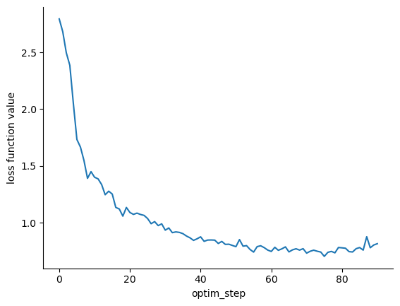

# Prototype 0

The purpose of this prototype is to establish a very simple weather emulator
pipeline that we can further refine and scale up.
Compared to GraphCast, this has:
- Reduced variable set
    * Inputs: surface pressure, 10m zonal/meridional winds, 3D temperature,
      year/day progress
    * Targets: surface pressure, 10m zonal/meridional winds, 3D temperature,
    * Forcings: land, year/day progress
- 3 vertical levels: approximately 1000 hPa, 500 hPa, 100 hPa, but on the native
  FV3 vertical grid
- 6 hour time step and make 1 step ahead predictions
- 1 degree horizontal resolution (C384)
- 1 year of training data
- 1 year of evaluation data
- Evaluate on and with WeatherBench2
- Simple data normalization just to get moving: data normalized based on avg/std taken over 1994-1997

The configuration is defined in [simple_emulator.py](simple_emulator.py), and the training can be
run with the script [run_training.py](run_training.py as

```bash
python run_training.py
```

This will produce the following loss curve, indicating things are going in the
right direction.



Alternatively, training can be executed with [train.py](train.py) as

```bash
python train.py --chunks-per-epoch 1 --batches-per-chunk 1 --latent-size 32
```
as specified in [train.py](train.py) (see file header for help with runtime
options).

The two training scripts will be merged in the future.

## Notes

### Normalization

The normalization fields were computed using
[calc_normalization.py](calc_normalization.py), and there
are many unnecessary hard coded values.
This code should be generalized in the future, and could probably be more
efficient, e.g. with a dask cluster rather than brute force slurm job
submission.
Some points of generalization include:
- storage location input/output (which would generalize resolution and model
  component)
- time frame and data frequency (timestep) used
- the averaging may need to take into account a more accurate grid cell volume
  weighted average
- the `year_progress` and `day_progress` fields are computed by graphcast, and
  these calculations should go here so that the correct normalization can be
  computed. Right now those normalization values are hard coded into
  `graphufs.ReplayEmulator.load_normalization`
